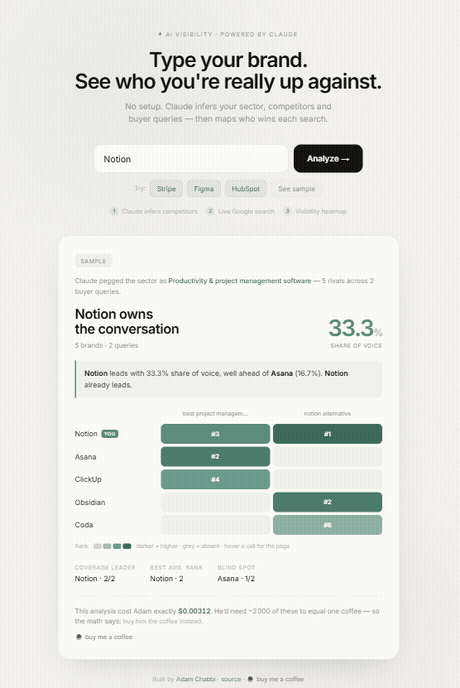

# Nadelio, AI Visibility Intelligence

> **A brand visibility score you can actually show your board, not noise.**

### [**Try Nadelio**](https://nadelio.com)



When a buyer searches *"best tool for X"*, who shows up, you or your competitors? And when they ask the same question to an AI assistant, who gets recommended?

Nadelio answers both with live data. You type a single brand name; the system identifies your competitive set, runs live Google searches, checks AI engine recommendations, and renders a dual heatmap of SERP ranks against AI mentions, side by side. This is the measurable side of **GEO / AEO (Generative Engine Optimization)**.

The difference: most tools hand you a single number that is really a noisy sample of one on a non deterministic model. Nadelio measures across multiple runs and reports a **bounded score** (a value with its confidence), so you know whether a move is real or just noise.

---

## How it works

A 4-step pipeline:

```
  "Notion"  ->  Claude  ->  competitors + buyer-intent queries
                                  |
                                  v
                          Bright Data SERP API  ->  live Google results
                                  |
                                  v
                          Claude AI check  ->  AI engine recommendations
                                  |
                                  v
                    dual heatmap, share of voice, AI engine leader
```

1. **Competitive intelligence.** A single brand name goes to Claude, which infers the sector, real competitors, and the buyer-intent queries a customer would search.
2. **Live SERP data.** Each query runs against Google via Bright Data. The app finds where every brand ranks.
3. **AI engine check.** Claude checks how an AI assistant would answer the same buyer questions, revealing which brands get recommended in AI-powered search.
4. **Dual heatmap.** Green cells for SERP ranks, purple cells for AI mention order, plus share of voice, coverage, average rank, and clickable evidence.

## Key features

- **Bounded score.** A visibility score reported with its confidence across multiple runs, not a single noisy number.
- **Dual visibility.** SERP and AI recommendations in one view. See the gap between traditional and AI-powered search.
- **Zero configuration.** Type one brand name, get a full competitive analysis in about 10 seconds.
- **Persistent cache.** Analyses are cached for instant re-access.
- **Pro plans coming soon.** Ongoing monitoring, alerts, and expanded analysis.

## Run locally

```bash
git clone https://github.com/arochab/nadelio.git
cd nadelio
pip install -r requirements.txt

export BRIGHTDATA_API_KEY="your_bright_data_key"
export ANTHROPIC_API_KEY="your_anthropic_key"
python app.py
# open http://localhost:5000
```

Without API keys, the app runs in **sample mode** with precomputed data.

## Also in this repo

Command-line tools the web app builds on:

```bash
# Single Google query to structured JSON / CSV
python serp_scraper.py "your keyword" --csv

# Multi-brand visibility report from the terminal
python ai_visibility.py --config visibility_config.example.json
```

## License

[MIT](LICENSE) · Built by [Adam Chabbi](https://github.com/arochab)
